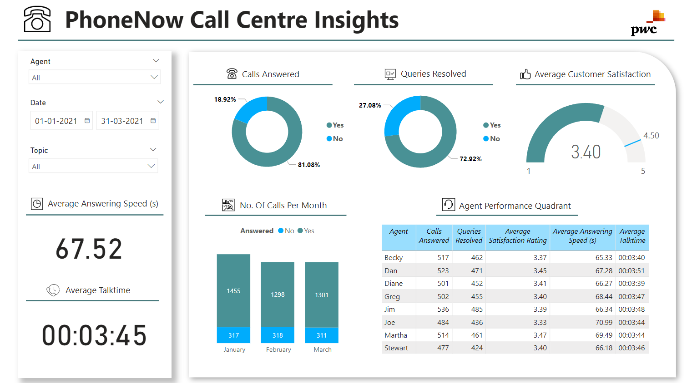

# Data Analytics & Visualization with Power BI

## Project Overview

This project is part of the [PwC Switzerland Power BI in Data Analytics Virtual Case Experience](https://www.theforage.com/simulations/pwc-ch/power-bi-cqxg), demonstrating the application of digital tools in data visualization, automation, data cleansing, and more to address common business challenges. It features a series of Power BI dashboards focusing on Call Centre Trends, Customer Retention, and Diversity & Inclusion. Each dashboard provides actionable insights into different facets of business operations and strategic planning, aiding PwC Switzerland and its clients in enhancing operational efficiency, fostering customer loyalty, and promoting a more inclusive workplace.

Through meticulous data analysis and visualization, this project aims to support informed decision-making and highlight areas for improvement and innovation.

## Usage

The `.pbix` files associated with each dashboard are hosted within this repository. Download the `.pbix` files from the repository and open them with Power BI Desktop. The data sources are embedded within the files, eliminating the need for additional setup to explore the visualizations. Users can navigate through the dashboards using the tabs at the bottom of the Power BI interface to explore different visualizations and insights.

To download the `.pbix` files, navigate to the folder in this repository where they are stored, select a file, and use the 'Download' button. Cloning or downloading the entire repository is an alternative method for accessing all files.

## Dashboards and Visualizations

### Call Centre Trends

The first dashboard provides a comprehensive view of call center metrics, focusing on customer satisfaction, call volumes, and agent performance. It aids in identifying areas for improvement in call center operations.

### Customer Retention

This dashboard was developed in response to a request from the telecom's Retention Manager, showcasing key metrics related to customer loyalty and retention. It visualizes data to predict customer churn and identifies potential strategies to enhance customer retention.

    

    

### Diversity & Inclusion

Focusing on the telecom client's goal of improving gender balance at the executive management level, this dashboard visualizes metrics related to diversity and inclusion, offering insights into current trends and areas for action.

    

    

